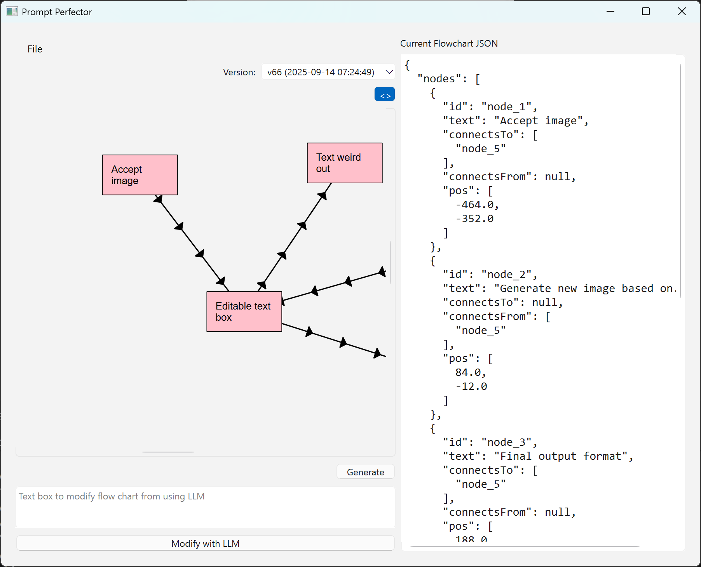
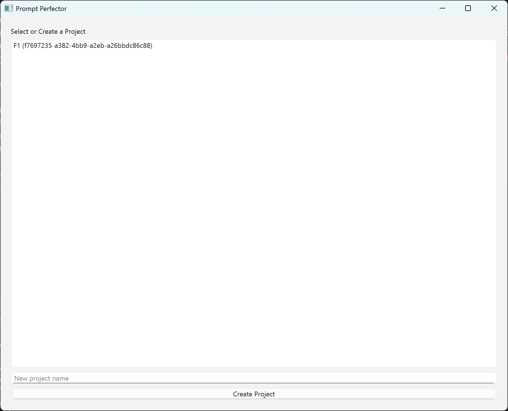
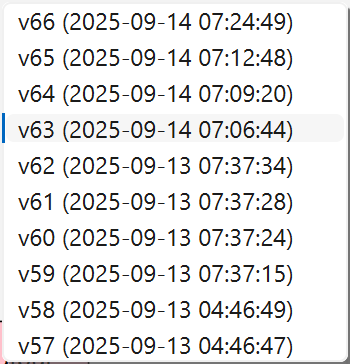
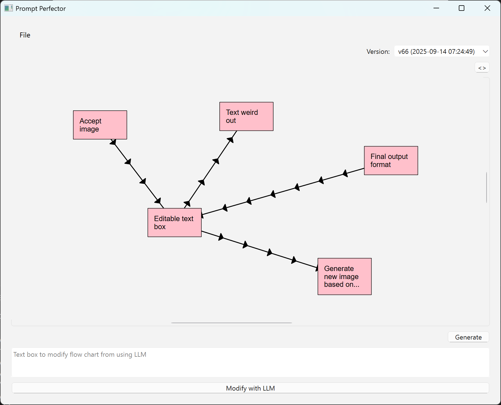

# Prompt Perfector

Prompt Perfector is a cross-platform Python application for designing, refining, and versioning prompt flows using an interactive flowchart UI and local LLM integration.

---

## Features

### 1. Project Management
- Multi-project support: create, switch, and manage multiple prompt projects.
- Each project has a unique ID and its own versioned flowchart history.

### 2. Flowchart Canvas
- Infinite, zoomable canvas for visual prompt design.
- Drag-and-drop text nodes (auto-assigned GUIDs).
- Click-to-connect model: create connectors by clicking connector buttons on nodes.
- Connectors are directional, with repeated arrowheads for clarity.
- Nodes and connectors can be deleted via context menu.
- Node interactions:
    - Drag: single left-click and move
    - Edit: double-click to edit text
    - Context menu: right-click for edit/delete
    - Connector: click connector button, then another to connect
- Autosave on meaningful changes (node move, edit, connect, delete).
- Version dropdown (shows latest 10 versions for quick access).

### 3. LLM Integration
- Text box for natural language modification of the flowchart using an LLM.
- Flowchart is sent as JSON to the LLM; LLM returns a modified JSON.
- Each LLM modification creates a new flowchart version.
- LLM runs locally (stub provided; pluggable for custom LLM backends).

### 4. Final Prompt Screen
- Converts the flowchart into a text-based prompt definition using the LLM.
- Displays the final, refined prompt for user review or export.

### 5. Database & Versioning
- All flowchart versions are stored in SQLite, linked to project ID and timestamped.
- Full version history per project; only latest 10 shown in UI for convenience.

### 6. Debugging & Logging
- File-based logging of all major actions (node/connector creation, deletion, autosave, versioning, LLM calls).
- Debug mode for local development; ship mode for production (no debug markers).

### 7. Cross-Platform
- Runs on Windows and MacOS (PySide6 GUI).

---


## Requirements

- Python 3.9+
- PySide6
- uuid
- (sqlite3 is included in Python stdlib)

Install dependencies:

```
pip install -r requirements.txt
```

## Architecture

- **UI:** PySide6 (QGraphicsView, QGraphicsScene, QGraphicsRectItem, QGraphicsLineItem, QComboBox, QMenuBar)
- **Persistence:** SQLite (projects, flowchart versions, JSON blobs)
- **LLM:** Local stub (replaceable with any local LLM API)
- **Logging:** Custom logger writes to debug.log

---

## Example Flowchart JSON

```
{
    "nodes": [
        {
            "id": "abc",
            "text": "Do Task 1",
            "connectsTo": ["efg"],
            "connectsFrom": null,
            "pos": [100, 200]
        },
        {
            "id": "efg",
            "text": "Do Task 2 with Task 1 output",
            "connectsTo": ["hij"],
            "connectsFrom": ["abc"],
            "pos": [300, 200]
        },
        {
            "id": "hij",
            "text": "Use output from Task 1 and Task 2 to perform Task 3",
            "connectsTo": null,
            "connectsFrom": ["abc", "efg"],
            "pos": [500, 200]
        }
    ]
}
```

---

## Usage

1. Launch the app (`python -m promptperfector.main` or packaged executable).
2. Create/select a project.
3. Design your prompt flow visually on the canvas.
4. Use the LLM text box to modify the flowchart with natural language.
5. Switch between flowchart versions using the dropdown.
6. View/export the final prompt on the Final Prompt screen.

---

## Development & Shipping

- Debug mode: full logging, developer tools enabled.
- Ship mode: optimized, no debug markers.
- Build as a single executable for Windows/MacOS (see packaging instructions).

---

## Clients

- Windows
- MacOS

## UI Mocks

<table>
    <tr>
        <td>
            
        </td>
        <td>
            
        </td>
    </tr>
    <tr>
        <td>
            
        </td>
        <td>
            
        </td>
    </tr>
</table>